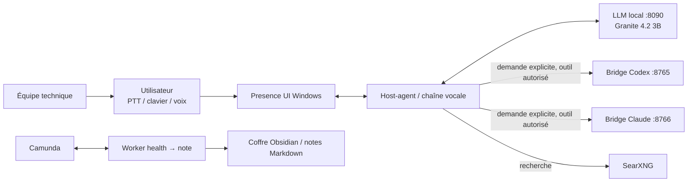
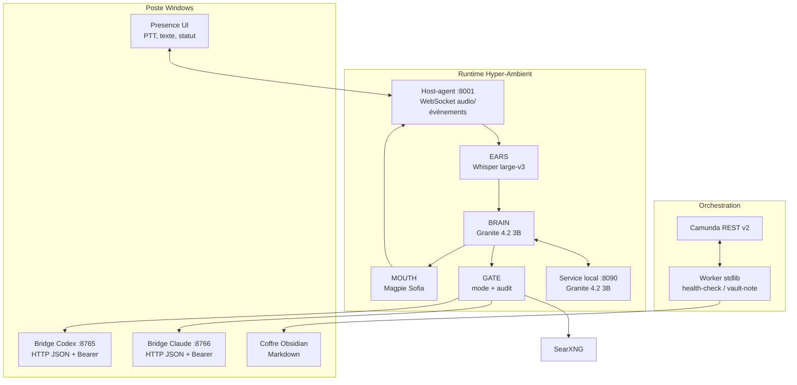
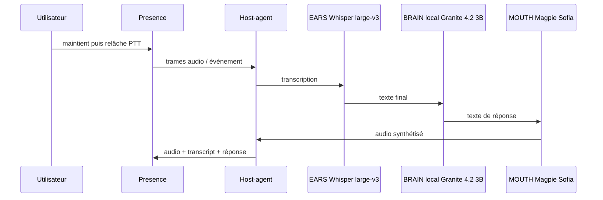
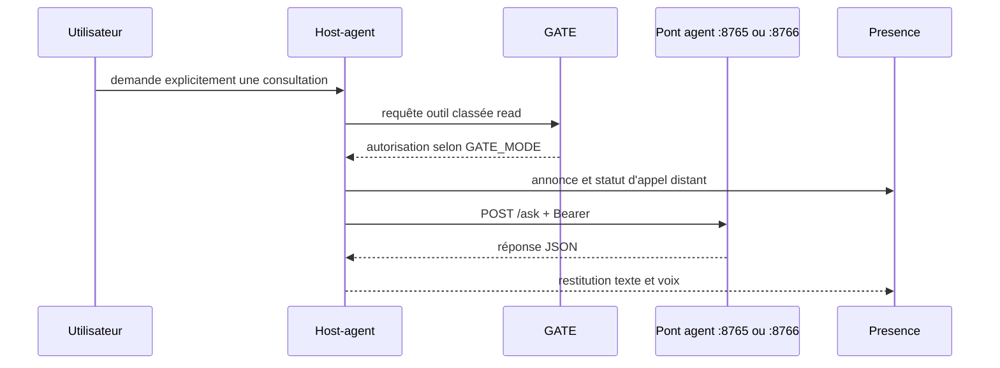
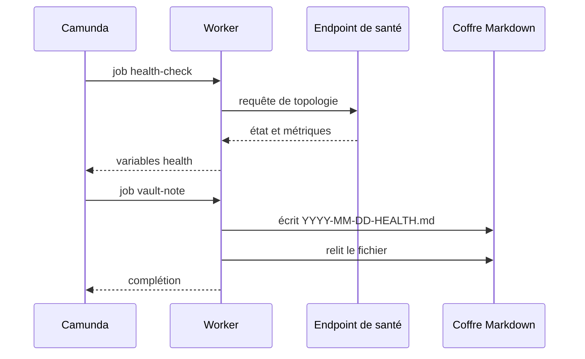

# Annexe technique — Hyper-Ambient

> **Règle de lecture.** Cette annexe sépare l'existant prouvé dans le dépôt, la cible de démonstration et les éléments à vérifier. Une référence `[S…]` suit chaque assertion factuelle ; les références pointent vers une ligne de code, une note datée ou un commit. Les choix de modèles sont **figés** depuis le 19 septembre : cerveau Granite 4.2 3B Q4_K_M, oreille Whisper large-v3 int8, voix Magpie TTS 357M (Sofia) — voir `2026-09-19-CARTE-FIGEE.md`. [S01]

## [À PROUVER] restants — arbitrage Claude / Thomas

1. Carte des composants IA : **figée le 19 septembre** (Granite 4.2 3B Q4_K_M, Whisper large-v3 int8, Magpie TTS voix Sofia) ; les réglages de lancement ne sont pas encore inscrits dans la configuration de référence — **[À PROUVER]** jusqu'à ce que la carte soit rendue persistante. [S01]
2. Écoute réseau et conservation de l'audio — **vérifié le 20/09, avec une réserve** : le host-agent est lancé avec `HOST = "0.0.0.0"` (`dev/scripts/serve_hostagent.py:49`), donc il **n'écoute pas uniquement en localhost** ; il n'est joignable de l'extérieur que si le port est publié et le pare-feu ouvert, et un secret est exigé. Correctif recommandé avant diffusion publique : lier à `127.0.0.1` par défaut. En revanche, **l'audio entrant n'est écrit nulle part** : aucune écriture de fichier audio dans le chemin d'exécution (seuls les bancs d'essai de `dev/scripts/` produisent des fichiers `.wav`). [S02]
3. La preuve C1 d'un tour vocal complet appelant un pont externe, et la preuve C2 d'alerte/reprise avec captures et OUT : **PROUVÉ pour C2** (`2026-09-19-C2-ALERTE.md`, 7 tests verts, captures avant/pendant/après) ; **C1 : chargement des clés prouvé (37 tests), tour vocal complet vers un pont externe encore [À PROUVER]**, les lanes C1/C2 étant encore séparées de la lane documentaire X1. [S01]
4. Suites de tests, exécution du 19/09 ~20h : conteneur **1105 passés, 11 ignorés, 2 échecs** (tests Presence natifs Windows, qui passent sous Windows : 32/32 avec santé et premier tour). À **relancer la veille de la soutenance**. [S03]
5. Retours utilisateurs : **hors périmètre de la version 0.1** — aucun mécanisme de collecte automatisée n'est implémenté, et rien n'est donc conservé. Le retour est aujourd'hui humain et tracé dans les notes de séance (`nights/`), notamment les dégustations à l'aveugle du 19 septembre. À présenter comme une évolution, pas comme un acquis. [S02]
6. Accessibilité — **contrastes mesurés le 20/09** sur les couleurs de l'interface Presence (`native/presence/app.py`) : texte principal sur fond 12,9:1, texte secondaire 6,1:1, texte sur bouton clair 14,3:1 — tous au-dessus du seuil AA (4,5:1), les deux premiers au niveau AAA (7:1). Le focus clavier est rendu visible (`_rendre_focus_visible`, liaisons `<FocusIn>`/`<FocusOut>`) et les commandes sont atteignables au clavier (`takefocus=1`). Restent **[À PROUVER]** : essai avec un lecteur d'écran et parcours complet avec un utilisateur ; le délai avant premier son est **mesuré** au test live du 19/09 dans le profil figé : ~1,1 s (phrase courte), oreille 0,45–0,7 s, 1er jeton 25–70 ms (`2026-09-19-CARTE-FIGEE.md`). [S02]

## 1. Résumé exécutif et périmètre

Hyper-Ambient est présenté ici comme un assistant vocal pour une petite équipe technique : il reçoit une sollicitation, traite localement la conversation courante et peut, à la demande, consulter des outils ou agents externes. Le périmètre fixé est français, Windows, application clé-en-main, public tech/IA. **L'anglais est livré dès la version 0.1** (bascule par `HA_LANG=en`, le français restant le défaut) ; Mac et espagnol appartiennent à la feuille de route. [S04][S29]

L'architecture est **local-first** : une interface Windows et un host-agent manipulent le micro, le rendu sonore et l'affichage, tandis que le service conteneurisé porte l'orchestration vocale. Le composant de raisonnement local est accessible sur le port `:8090`; le host-agent utilise `:8001`. [S05][S06]

Le mot « automatisation » ne signifie pas qu'une action externe est libre. L'automatisation démontrable est l'orchestration BPMN d'un contrôle de santé vers une note Markdown, plus un registre d'outils filtré par configuration et une porte d'autorisation (`GATE_MODE`). MOTHER reste un composant logiciel ; Camunda/BPMN est l'élément low-code de l'ensemble. [S07][S08][S09]

### Carte des composants IA — **figée le 19 septembre 2026**

Les modèles ont été choisis **à l'aveugle par l'utilisateur final** : voix égalisées au même volume et présentées sous des lettres, questions improvisées pour les cerveaux, transcriptions comparées sur ses propres enregistrements. Le protocole et les résultats sont en annexe (`2026-09-19-PROTOCOLE-DEGUSTATION.md`, `2026-09-19-CARTE-FIGEE.md`).

| Fonction | Modèle retenu | Exécution | Rôle |
|---|---|---|---|
| EARS / oreille | **Whisper large-v3** (faster-whisper, int8) | GPU, français | Convertit la voix en texte avant le tour de décision. Mesuré 0,45 à 0,7 s par phrase. [S05] |
| BRAIN / cerveau local | **Granite 4.2 3B**, quantifié Q4_K_M | llama-server sur `:8090`, GPU | Répond localement. Premier mot en 25 à 70 ms. Licence Apache-2.0. [S06] |
| MOUTH / voix | **Magpie TTS 357M**, voix « Sofia » | GPU | Transforme la réponse en voix. Premier son à environ 1,1 s. [S05] |
| Composant IA distant | Optionnel, par clé d'API | Hors machine | Sollicité seulement par un outil prévu ; ne remplace pas la réponse locale. [S10] |

L'ensemble tient dans **7,3 Go de mémoire graphique sur 12** au repos, ce qui laisse la machine utilisable pendant la démonstration. Replis documentés si un modèle venait à manquer : NeoHorse-1-9B pour le cerveau, Parakeet-TDT-0.6B pour l'oreille, Supertonic F5 pour la voix (celle-ci sans GPU).

### Internationalisation — anglais livré en 0.1

Le produit bascule en anglais par la variable `HA_LANG=en` (ou `HYPER_AMBIENT_LANG`), toute autre valeur ramenant au français. La bascule couvre l'invite système du cerveau, les libellés de l'interface et de l'accueil, la normalisation des nombres et heures, et les questions envoyées au classifieur d'entrée. Preuve : 13 tests dédiés verts, et les tests français inchangés (`2026-09-19-C8-EN-OUT.md`). [S29]

## 2. Architecture C4 — niveaux 1 et 2

### Niveau 1 — contexte système

L'interface Presence est une application fenêtrée « appuyer-pour-parler » et conserve une alternative textuelle : transcription, réponse et état d'appel distant sont affichés. [S11] Les ponts d'agents ont été relevés UP avec PONG le 19 septembre sur `:8765` et `:8766`; cette constatation ne vaut pas preuve d'un tour vocal C1 complet. [S12]

Le coffre est un espace de notes Markdown : le worker construit une note datée de santé et la relit avant de terminer son travail. [S13] Le processus BPMN comporte explicitement un départ nocturne, un `health-check`, une tâche d'écriture de note et une fin. [S14]

### Niveau 2 — conteneurs et responsabilités

Le serveur du host-agent est défini sur le port `8001`, compose EARS/BRAIN/MOUTH, puis construit un registre et une porte avant d'accepter les tours. [S05] Le protocole hôte est décrit comme un WebSocket de transport, et le noyau d'architecture distingue les primitives de capture/rendu audio, injection d'entrée et dessin de surface. [S15][S16]

La présence d'un service local `:8090`, du host-agent `:8001`, de SearXNG, des ponts et de Presence dans la topologie du 19 septembre est documentée comme état de session. Cela ne constitue pas une garantie de disponibilité future : chaque démonstration doit refaire ses contrôles de santé. [S12][S17]

### Découpage des responsabilités

| Conteneur / système | Responsabilité | Frontière importante |
|---|---|---|
| Presence | Interaction PTT, raccourci, affichage du texte et de l'état distant. [S11] | Ne décide pas du contenu d'une réponse. [S11] |
| Host-agent | Chaîne EARS → BRAIN → MOUTH et échange de trames/événements. [S05][S15] | L'audio matériel reste côté hôte Windows. [S18] |
| Service local `:8090` | Endpoint de raisonnement local ; carte de modèle non arrêtée dans ce document. [S06] | Sa santé est vérifiée avant démonstration. [S17] |
| Ponts `:8765` / `:8766` | Soumettent une question à un harnais d'agent via HTTP, avec authentification Bearer. [S19] | Sans jeton, une sonde est refusée (401) dans le compte rendu de test. [S20] |
| SearXNG | Backend de recherche sélectionnable par la configuration du registre. [S05] | Un repli tiers peut n'être activé que si sa configuration existe. [S05] |
| Camunda + worker | Orchestre les jobs `health-check` et `vault-note` via REST v2. [S09] | Le worker écrit une note Markdown, pas une commande système. [S13] |
| Coffre de notes | Conserve les notes de coordination et de santé en Markdown. [S13][S21] | La stratégie de rétention et les droits d'accès restent à formaliser. **[À PROUVER]** [S02] |

## 2.4 Outillage de flotte — accountability en circuit fermé

**Problème constaté (19 septembre).** Dans une orga à plusieurs agents (organisateur, Cursor, Codex, Claude), la fin réelle des tâches était peu visible : des lanes « fantômes », pas de signal net entre le lancement et la preuve, et des relances humaines pour savoir si une tâche tournait encore.

**Dispositif mis en place le 20 septembre.** Chaque lane est ouverte et fermée dans un registre commun, avec deux artefacts obligatoires : un **OUT** (note datée dans `nights/`) et un **EXIT** (code de sortie du travail exécuté). Aucune tâche n'est lancée sans carte ni sans OUT.

| Élément | Rôle | Preuve |
|---|---|---|
| `dev/scripts/account.py` | Ouvre, jalonne et ferme une lane (`open` / `pulse` / `close` / `board`) | Script versionné dans le dépôt |
| `nights/ACCOUNTABILITY-LEDGER.jsonl` | Journal append-only des événements | 16 événements au 20/09 10h40 (11 ouvertures, 2 jalons, 3 clôtures) |
| `nights/ACCOUNTABILITY-BOARD.md` | Tableau lisible « en cours / terminé », régénéré | Horodaté 2026-09-20T10:37 |
| `nights/2026-09-20-DEMO-ACC-OUT.md` + `-EXIT.txt` | Démonstration du circuit complet sur une lane réelle | OUT et EXIT produits |

**Règle de notification figée par le commanditaire** : une tâche *simple* est gérée par l'organisateur et ses ponts ; une tâche *complexe* notifie d'abord la supervision, qui en informe l'organisateur. Le registre porte ce champ pour chaque lane.

**Portée pour le dossier.** C'est la trace d'automatisation la plus directe du projet côté conduite de projet : un processus semi-automatisé, journalisé, avec preuve de fin de tâche — et non une simple liste de tâches. Hors périmètre de cette version : interface graphique, notation de qualité, remplacement du tableau Obsidian (complément, pas doublon). Source : `nights/2026-09-20-MAKINGOF-ACCOUNTABILITY.md`. [S28]

## 3. Interopérabilité et synchronisation

| Système A → B | Sens / déclencheur | Protocole et format | Authentification / contrôle | Preuve |
|---|---|---|---|---|
| Presence ↔ host-agent | PTT, trames audio, états et rapport | WebSocket ; primitives audio/événements | Secret de transport configuré côté host-agent ; exposition hors machine déconseillée par le code. | [S15][S22] |
| host-agent → service local | Réponse locale d'un tour | HTTP, endpoint local `:8090` | Santé contrôlable avant démo ; modèle **Granite 4.2 3B Q4_K_M**, alias `mother-local`. | [S06][S17] |
| host-agent → pont Codex | Outil `ask_codex` inscrit si jeton et client disponibles | `POST /ask`, JSON | Bearer ; refus sans jeton consigné. | [S05][S20] |
| host-agent → pont Claude | Outil `ask_claude` inscrit si jeton et client disponibles | `POST /ask`, JSON | Bearer ; refus sans jeton consigné. | [S05][S20] |
| host-agent → SearXNG | Outil de recherche si URL configurée | HTTP JSON | Pas de clé pour l'instance locale selon le code ; repli tiers conditionnel. | [S05] |
| Camunda ↔ worker | Activation et complétion de jobs | REST API v2, JSON | URL configurable du worker ; détail de l'authentification **[À PROUVER]**. | [S09] |
| worker → coffre | Après health-check | Écriture puis relecture d'un fichier Markdown daté | Droits du coffre **[À PROUVER]**. | [S13] |

**Point critique de synchronisation 1 — registre/outils.** Les outils ne sont exposés que si leur prérequis de configuration est présent ; une vérification compare les outils actifs aux outils attendus et refuse notamment un outil non prévu. Ainsi, une configuration incomplète doit se traduire par l'absence de l'outil, plutôt que par un échec tardif de la conversation. [S05]

**Point critique de synchronisation 2 — health/note.** Le worker traite `health-check`, produit des variables d'état, puis `vault-note` construit le Markdown et relit le contenu du fichier avant complétion. La relecture réduit le risque d'annoncer une note écrite alors qu'elle ne l'est pas ; la preuve d'une exécution Camunda de bout en bout à la soutenance reste **[À PROUVER]**. [S09][S13]

## 4. Flux de données et règles de protection

### Flux A — voix vers réponse vocale locale

Le parcours correspond à la composition EARS/BRAIN/MOUTH du point d'entrée du host-agent et à l'affichage de rapport côté Presence. [S05][S11] Le flux est local dans sa voie nominale ; toute affirmation de « rien ne sort du poste » doit cependant être limitée à cette voie, car une recherche ou une demande de pont est un flux distinct. [S02][S05]

### Flux B — escalade distante contrôlée

`ask_codex` et `ask_claude` sont enregistrés à condition que les jetons correspondants existent ; le code associe le premier à une opération « lecture seule » et construit la porte depuis `GATE_MODE`, par défaut `auto`. [S05] L'interface distingue textuellement l'appel distant et l'état local. [S11]

Le recadrage produit du 19 septembre établit que l'utilisateur — voix ou bouton — décide d'envoyer une tâche à un agent ; aucun « routeur d'escalade » autonome n'est à présenter. La réponse locale reste le comportement attendu pendant le travail distant. [S10]

### Flux C — health vers note de coffre

Le BPMN associe trois tentatives aux deux tâches, et le worker reconnaît les deux types de jobs. [S14][S09] Le statut produit par le handler distingue notamment `UP` et `DEGRADED`. [S13]

### Règles RGPD applicables au flux

La voix, sa transcription et une requête d'agent peuvent constituer des données personnelles selon leur contenu ; le projet doit donc appliquer les principes du RGPD, notamment protection des données dès la conception et par défaut (article 25), sécurité du traitement (article 32), information des personnes et droits d'accès/effacement. [S23]

Mesures déjà ancrées : les secrets sont hors versionnage dans `.env.local` et montés en lecture seule dans le conteneur selon l'état de projet ; le journal d'audit est conçu pour ne conserver que des paramètres assainis, pas les secrets. [S18][S16] Mesures à faire valider avant usage réel : base légale, notice d'information, durée de conservation de l'audio/transcriptions, droits d'accès au coffre et procédure d'effacement. **[À PROUVER]** [S23]

## 5. Automatisation IA — angle BC02

### Ce qui est automatisé, semi-automatisé ou volontairement manuel

| Cas | Niveau | Mécanisme | Limite de contrôle |
|---|---|---|---|
| Santé nocturne → note | Automatisé | BPMN `health-check` puis `vault-note`, worker REST v2. [S09][S14] | Déploiement/planification live à prouver. **[À PROUVER]** [S02] |
| Veille de nuit → note | Semi-automatisé | Un script de veille et une proposition de cron sont mentionnés dans l'organisation de session. [S24] | Fréquence effective et validation humaine à prouver. **[À PROUVER]** [S02] |
| Consultation d'un agent | Déclenché par l'utilisateur | Registre `ask_*`, annonce vocale, porte `GATE_MODE`. [S05] | Le modèle ne décide pas seul de déléguer. [S10] |
| Recherche web | Déclenché par l'outil | Registre avec SearXNG et repli conditionnel. [S05] | Toute sortie de données hors poste doit être rendue visible à l'utilisateur. [S23] |
| Onboarding | Assisté | Wizard local : bienvenue, PTT, masquage ; configuration stockée localement. [S11] | Test utilisateur de bout en bout à prouver. **[À PROUVER]** [S02] |
| Coordination de production | Semi-automatisé / documentaire | Les notes `nights/` portent les briefs, OUT et arbitrages entre rôles. [S21][S01] | Ce n'est pas un moteur de workflow transactionnel. [S21] |

Le coffre `nights/` fonctionne comme un bus documentaire de coordination : les rôles OC, Cursor, Codex et Claude sont explicitement distribués dans la note d'organisation, et l'arbitrage sépare les fichiers de travail pour éviter les collisions. [S21][S01] Cette coordination reste humaine : les notes portent le contexte et la preuve, mais aucune note ne constitue à elle seule l'exécution d'une action sur le poste. [S21]

La porte GATE est le point d'autorisation : les modes documentés incluent `plan`, `ask`, `manual`, `auto`, `build`, `troubleshoot` et un mode explicitement dangereux. [S16] Dans l'intégration vocale, passer `GATE_MODE=ask` resserre l'autorisation sans modifier le code, tandis que `ask_codex` est catégorisé `read`. [S05] Pour la soutenance, le mode affiché, l'outil invoqué et le statut distant doivent être visibles : la catégorisation `read` n'est pas une autorisation de dissimuler une sortie de données. [S05][S11][S23]

## 6. Sécurité et maîtrise des risques

| Risque | Vraisemblance / impact à évaluer | Mesure existante | Mesure de clôture / référence |
|---|---|---|---|
| Jeton de pont divulgué | Moyen / élevé — grille à formaliser | Jetons lus depuis l'environnement ; ponts testés avec Bearer et refus sans jeton. [S05][S20] | Ne jamais imprimer le jeton, rotation et moindre privilège ; pratiques d'hygiène ANSSI. [S24] |
| Exposition réseau du host-agent | Moyen / élevé — **confirmé : écoute `0.0.0.0`** (`serve_hostagent.py:49`) | Le code avertit de ne pas exposer le service hors de la machine quand un secret de développement est utilisé, et l'adresse du client est ramenée à `127.0.0.1` quand elle est inconnue. [S22] | **Action avant diffusion** : lier à `127.0.0.1` par défaut, vérifier le pare-feu et utiliser un secret de production. [S02] |
| Injection de prompt via contenu web/agent | Moyen / élevé | GATE centralise la décision d'outil et le registre limite les outils configurés. [S05][S16] | Traiter le contenu externe comme non fiable ; validation humaine avant action ; risque OWASP « prompt injection ». [S25] |
| Exfiltration via appel distant | Moyen / élevé | Presence affiche un état d'appel distant ; l'utilisateur est la source de la décision de déléguer. [S11][S10] | Notice, minimisation des données envoyées et consentement/justification adaptés au contexte. [S23] |
| Note de santé erronée ou incomplète | Faible à moyen / moyen | Écriture suivie d'une relecture dans le worker. [S13] | Contrôle de contenu et gestion des droits du coffre. **[À PROUVER]** [S02] |
| Indisponibilité d'un pont ou surcharge GPU | Moyen / moyen | Procédure de reprise : rester local si pont indisponible ; éviter le chargement de composants hors profil. [S17] | Démonstration C2 produite (`2026-09-19-C2-ALERTE.md`) ; à rejouer en répétition. [S01] |
| Journal contenant un secret | Faible / élevé | ADR-012 : paramètres assainis, sans secret dans l'audit. [S16] | Test de non-régression et revue avant diffusion. **[À PROUVER]** [S03] |

Les références de conformité sont des garde-fous, pas une déclaration de conformité complète : le RGPD impose notamment une protection dès la conception/par défaut et des mesures de sécurité ; l'ANSSI publie un guide d'hygiène informatique ; OWASP maintient une liste de risques propres aux applications LLM. [S23][S24][S25]

## 7. Plan de tests et preuves attendues

L'inventaire du dépôt comporte notamment des tests pour audio, transports host-agent, gate/permissions, Presence/onboarding, outils/ponts, boucle d'outils, secours, EARS, TURN et MOUTH. Cette diversité atteste d'une stratégie de tests par composant ; elle ne permet pas d'affirmer un nombre de tests verts sans sortie d'exécution datée. [S03]

| ID | Scénario de recette | Preuve admissible | État de cette annexe |
|---|---|---|---|
| T1 | Dialogue vocal local simple | Log + capture Presence + réponse audible | **Fait** au test live 19/09 (stack figée, voix de Thomas) ; captures de dégustation `degustation-19/cerveau/captures/`. Réserve : 1re requête parfois perdue. [S02] |
| T2 | Consultation d'un agent par demande utilisateur | Log du registre, trace d'outil, rendu Presence | Cible C1 ; **[À PROUVER]** [S01] |
| T3 | Onboarding en trois étapes | Capture/walkthrough et fichier de configuration local | Fonctions présentes ; parcours live **[À PROUVER]** [S11] |
| T4 | Suites automatisées | Commande et sortie collée dans un OUT daté | 1105 passés / 2 échecs conteneur (natifs Windows, verts sous Windows) — 19/09. [S03] |
| T5 | Outils avec/sans jeton | Tests de registre et sondes 401/200 consignées | Chargement des clés prouvé hors process live : 37 tests verts et registre passant de 0 à 5 outils (`2026-09-19-C1-OUTILS.md`) ; sonde live **[À PROUVER]** [S20][S03] |
| T6 | Clavier, texte et contraste | Parcours Tab/Entrée et lecture du statut | Contrastes mesurés 12,9 / 6,1 / 14,3:1 (≥ AA) le 20/09 ; focus visible au clavier. Lecteur d'écran **[À PROUVER]** [S11][S02] |
| T7 | Délai jusqu'au premier son | Mesure horodatée dans le profil final | ~1,1 s phrase courte, 3,2–4,8 s phrase longue (19/09). [S02] |

Les tests nommés `test_outils_voix.py`, `test_codex_bridge.py`, `test_clibridge.py`, `test_gate_more_edges.py`, `test_presence_onboarding.py` et les suites MOUTH/TURN sont des points d'entrée directs pour T4/T5/T6. [S03] Avant soutenance, ne joindre que les sorties réellement obtenues dans un OUT ; les mesures historiques ne doivent pas être substituées à la carte finale ni à une exécution récente. [S01][S03]

## 8. Alertes et reprise

La procédure SKU10 prescrit un contrôle avant démonstration : conteneur, santé `:8090`, santé `:8001`, Presence visible et budget VRAM. [S17] Elle préconise une reprise unique par script de relance pour le host-agent, plutôt qu'une succession de réparations improvisées, et distingue explicitement les composants hors profil à ne pas charger. [S17]

| Symptôme de démo | Réponse opérationnelle documentée | Effet attendu / limite |
|---|---|---|
| Host-agent ne répond pas au PTT | Relance contrôlée du routeur/host-agent. [S17] | Retour du service ; validation live à refaire. |
| Voix muette ou coupée | Même reprise, puis passage en texte si le problème persiste. [S17] | Continuité de présentation, sans prétendre corriger la cause en direct. |
| Erreur d'autorisation liée à `.env.local` | Ne pas modifier l'environnement pendant la démo ; relancer selon la procédure. [S17] | Réduit le risque de corruption/manipulation de secret live. |
| Pont agent indisponible | Annoncer l'indisponibilité et poursuivre localement. [S17] | **Prouvé** : lane C2 du 19/09 — alerte visible puis reprise, 7 tests verts et trois captures de l'application (`2026-09-19-C2-ALERTE.md`). [S01] |
| Rien ne repart | Démarrer le conteneur existant sans recréation, puis refaire les préchecks. [S17] | Escalade opérateur si échec persistant. |

La démonstration attendue C2 — composant coupé, alerte visuelle et vocale, note de coffre, relance, retour vert — est une cible indiquée dans le brief Cursor ; ne pas la décrire comme réalisée tant que son OUT et ses captures ne sont pas disponibles. [S26][S01]

## 9. Qualité, conformité continue et sobriété

La sobriété est d'abord un choix d'architecture : traitement local par défaut, consultation distante volontaire, et carte de composants IA tenue ouverte tant que les contraintes de machine et de qualité ne sont pas arbitrées. [S04][S10][S01] Le risque de GPU partagé est explicitement signalé à 12 Go pendant la dégustation ; aucun chargement de modèle ou relance du service local ne doit être déclenché sans feu vert de l'arbitrage. [S01]

L'accessibilité est intégrée au design de Presence : Tab parcourt les commandes, Entrée active un bouton, la touche de parole peut être maintenue, et transcription/réponse/appel distant restent affichés. [S11] Cela fournit une alternative texte à la voix. Les contrastes ont été mesurés le 20/09 (12,9 / 6,1 / 14,3:1, tous au-dessus du seuil AA) ; la vérification avec un lecteur d'écran et de vrais utilisateurs reste **[À PROUVER]**. [S02]

La qualité continue repose sur trois traces complémentaires : tests automatisés versionnés, notes `nights/` datées, et historique Git. La présence de ces trois mécanismes est démontrable dans le dépôt ; leur cadence de revue doit être assignée par Thomas. [S03][S21][S27]

## 10. Feuille de route priorisée (RICE qualitative)

Les items ci-dessous reprennent la roadmap de session. Les valeurs chiffrées RICE (reach, impact, confidence, effort) ne sont pas inventées : la priorisation est qualitative tant qu'une estimation par Thomas n'est pas renseignée. [S04]

| Initiative | Reach | Impact | Confidence | Effort | Décision de priorité / source |
|---|---|---|---|---|---|
| Stabiliser alerte + reprise | Utilisateurs de démo | Élevé | Moyen, cible C2 | Moyen | P0 : preuve de fiabilité demandée avant soutenance. [S26] |
| Stabiliser service tiers contrôlé | Utilisateurs de démo | Élevé | Moyen, cible C1 | Moyen | P0 : le jury doit voir une interop réelle. [S01][S26] |
| Version Mac | Futurs utilisateurs Mac | Moyen | Moyen | À estimer | P1 : roadmap explicitement nommée. [S04] |
| EN / ES | Futurs utilisateurs non FR | Moyen | Moyen | À estimer | P1 : hors périmètre français actuel. [S04] |
| Hyper-Ambient-XL (~20 Go VRAM) | Poste doté d'un GPU adapté | Potentiellement élevé | Faible à ce stade | Élevé | P2 : piste de roadmap, à dimensionner. [S04] |
| Routeur déterministe local | Usage vocal mains libres | À discuter | Faible à moyen | À estimer | P2 : le recadrage exclut la délégation autonome ; usages candidats seulement. [S10] |

Le dossier JeV conclut qu'un routeur d'escalade n'est pas l'usage produit : l'utilisateur choisit le distant et le local répond pendant l'attente. Les usages candidats d'un composant déterministe sont plutôt fin de tour, détection d'adresse, interruption, ton ou confirmation sensible ; aucune décision d'implémentation n'est arrêtée. [S10]

## 11. Documentation, traçabilité et gestion de version

Les notes `nights/` servent d'artefacts datés : organisation, arbitrage, procédure incident, brief de démonstration et OUT attendus. [S21][S01][S17] L'arbitrage du 19 septembre isole expressément X1 dans ce seul fichier annexe ; il interdit à cette lane documentaire de modifier le code ou la configuration. [S01]

Exemples de journal de versions relevant de l'historique Git :

| Commit | Objet lisible | Apport traçable |
|---|---|---|
| `779bc4c` | Camunda : worker de santé et outillage de recette | Ancre l'automatisation BPMN/worker. [S27] |
| `83d51f3` | BRAIN : outils et recherche SearXNG | Ancre l'évolution des outils. [S27] |
| `99756d9` | Presence : interruption, onboarding et fenêtre | Ancre l'interface et l'onboarding. [S27] |
| `4f87024` | UI Presence et harnais Codex/Claude | Ancre la session de démonstration du 18 septembre. [S27] |

La documentation technique d'architecture prévoit aussi des ADR, dont la séparation noyau conteneurisé / host-agent natif et l'absence de secrets dans l'audit. [S16] Avant diffusion, toute capture ou log doit être relu pour supprimer token, chemin personnel non nécessaire et contenu de conversation sensible. Cette dernière règle est une mesure de publication à appliquer ; la vérification de chaque pièce est **[À PROUVER]**. [S16][S23]

## 12. Annexes

### A. Glossaire

| Terme | Définition opératoire / source |
|---|---|
| Presence | Interface Windows PTT qui affiche aussi les états et textes de conversation. [S11] |
| Host-agent | Service qui raccorde transport, EARS, BRAIN et MOUTH sur `:8001`. [S05] |
| EARS / BRAIN / MOUTH | Respectivement oreille, raisonnement et voix ; leurs modèles sont respectivement Whisper large-v3, Granite 4.2 3B et Magpie TTS (voix Sofia), figés le 19/09. [S05][S01] |
| GATE | Porte d'autorisation et journalisation des décisions de capacités. [S16] |
| `danger=read` | Catégorie d'outil en lecture ; elle est employée pour `ask_codex`/`ask_claude` dans les tests et le registre. [S05][S03] |
| BPMN | Notation du processus Camunda `night_health_vault_note`. [S14] |
| Coffre | Répertoire de notes Markdown où le worker écrit la note de santé datée. [S13] |
| PONG | Sonde de disponibilité des ponts d'agents ; PONG est consigné le 19 septembre. [S12] |

### B. Captures à insérer dans le dossier BGB

Les captures existantes de Presence sont signalées dans les suggestions BGB. Pour la version soutenance, retenir seulement des captures revues qui ne contiennent ni secret ni donnée personnelle : (1) Presence au repos avec alternative texte, (2) état « appel distant », (3) alerte/reprise C2 lorsque son OUT existe, (4) note health générée lorsque le flux live est prouvé. [S02][S11][S26]

### C. Références de preuve

| ID | Source |
|---|---|
| S01 | `nights/2026-09-19-BRIEF-CODEX.md:8-34`; `nights/2026-09-19-CLAUDE-ARBITRAGE-LANES.md:8-27` |
| S02 | `nights/2026-09-19-SUGGESTIONS-CASES-BGB.md:11-52` |
| S03 | Inventaire : `rg --files dev/tests` exécuté le 2026-09-19 ; exemples : `dev/tests/test_outils_voix.py:1-280`, `dev/tests/test_gate_more_edges.py:1-160`, `dev/tests/test_presence_onboarding.py:1-…` |
| S04 | `nights/2026-09-19-ORGA-SESSION.md:39-56` |
| S05 | `dev/scripts/serve_hostagent.py:24-41, 102-180, 353-402` |
| S06 | `nights/2026-09-18-SKU10-PANNE.md:11-18`; `nights/2026-09-19-HARNAIS-PONG.md:16` |
| S07 | `nights/2026-09-19-SUGGESTIONS-CASES-BGB.md:13-15` |
| S08 | `resources/bpmn/night_health_vault_note.bpmn:14-45` |
| S09 | `workers/night_health_vault_note/README.md:1-16`; `workers/night_health_vault_note/worker.py:2-39, 129-161` |
| S10 | `nights/2026-09-19-NOTE-JEV.md:14-32` |
| S11 | `native/presence/onboarding.py:11-45, 55-102, 123-137`; `native/presence/app.py:1035-1087` |
| S12 | `nights/2026-09-19-HARNAIS-PONG.md:8-16` |
| S13 | `workers/night_health_vault_note/handlers.py:14-112` |
| S14 | `resources/bpmn/night_health_vault_note.bpmn:12-46` |
| S15 | `ARCHITECTURE.md:7-70, 73-96`; `STACK.md:9-37` |
| S16 | `ARCHITECTURE.md:134-175`; `STACK.md:30-37, 72-74` |
| S17 | `nights/2026-09-18-SKU10-PANNE.md:11-43` |
| S18 | `STATUS.md:82-89` |
| S19 | `nights/2026-09-17-MUSE-HARNAIS.md:60-65, 98-102` |
| S20 | `nights/2026-09-18-HARNAIS.md:23-37` |
| S21 | `nights/2026-09-19-ORGA-SESSION.md:11-42` |
| S22 | `dev/scripts/serve_hostagent.py:218-230, 324-338` |
| S23 | [CNIL — texte du RGPD](https://www.cnil.fr/fr/reglement-europeen-protection-donnees), art. 12-17, 25 et 32 (consulté le 2026-09-19) |
| S24 | [ANSSI — Guide d'hygiène informatique](https://messervices.cyber.gouv.fr/guides/guide-dhygiene-informatique) (consulté le 2026-09-19) ; `nights/2026-09-19-CLAUDE-POUR-GROK.md:31` |
| S25 | [OWASP GenAI — LLM Top 10](https://genai.owasp.org/llm-top-10/) (consulté le 2026-09-19) |
| S26 | `nights/2026-09-19-BRIEF-CURSOR.md:26-27, 53-72`; `nights/2026-09-19-CLAUDE-PLAN-TECH.md:26-27` |
| S28 | `nights/2026-09-20-MAKINGOF-ACCOUNTABILITY.md` ; `dev/scripts/account.py` ; `nights/ACCOUNTABILITY-LEDGER.jsonl` (16 événements au 2026-09-20 10:40) |
| S29 | `nights/2026-09-19-C8-EN-OUT.md` ; `src/i18n/__init__.py` ; `dev/tests/test_c8_i18n.py` (13 tests verts) |
| S30 | `nights/2026-09-19-CARTE-FIGEE.md` ; `nights/2026-09-19-PROTOCOLE-DEGUSTATION.md` ; test live du 2026-09-19 ~20h |
| S27 | `git log --oneline -25` exécuté le 2026-09-19 |

